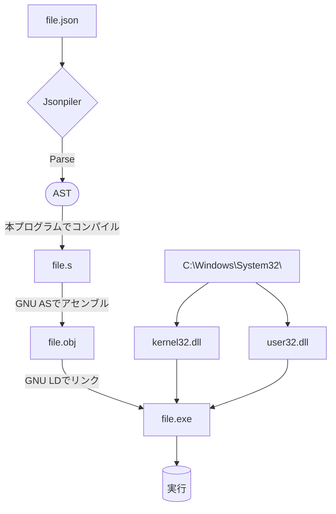

# Jsonpiler - JSON文法プログラミング言語

**Jsonpiler(ジェイソンパイラー)**は  
Jsonとほぼ同様の文法であるプログラミング言語と、  
それを実行可能な.exeファイルに変換するコンパイラです。

このプログラムは、JSONベースのプログラムをGNUアセンブリに変換し、
さらにアセンブリににGNU AS、GNU LDを使用して結果を実行します。

[英語(English)](https://github.com/HAL-G1THuB/jsonpiler/blob/main/README.md)

- [GitHubリポジトリ](https://github.com/HAL-G1THuB/jsonpiler)  
- [Crates.io](https://crates.io/crates/jsonpiler)  
- [Docs.rs](https://docs.rs/jsonpiler/latest/jsonpiler)  
- [AI生成ドキュメント](https://deepwiki.com/HAL-G1THuB/jsonpiler)  
🚨 **Windowsでのみ作動します (x64)!** 🚨

## 変更履歴

- **入力ファイルを1GB以下に制限したため、不要となったパーサー内のセーフティーチェックを排除し、高速化。**
- **アセンブリ命令の保存方法を変え、処理速度とメモリ効率を改善。**
- **cの関数(malloc, free)への依存をなくしたことにより、`ucrtbase.dll`が不要となった。**
- **組み込み関数のドキュメントが肥大化したため、複数のファイルに分割した。**
- **変数に束縛されていない関数の引数として渡された一時的な値が解放されるタイミングが、その関数が終了したときに定まった。(例外として、`if`の本体の最後の一時的な値は解放される)**
- **`if`, `scope`,`lambda`の引数の形式が変更された。**
- **新しい関数`value`が追加された。この関数は与えられた評価済みの値をそのまま返し、Objectの命令列の最後にリテラルを追加するために使用される。**
- 新しい関数を追加: `not`, `xor`, `or`, `and`
- 組み込み関数が肥大化したため、複数のファイルに分割した。
- 命令の肥大化による性能低下が予想されるため、bool型のメモリ領域を1bitから1byteに変更。
- 関数の引数検証を直感的に。
[プロジェクトの歴史と計画](https://github.com/HAL-G1THuB/jsonpiler/blob/main/CHANGELOG-ja.md)

## 前提条件

**以下のツールがインストールされ、PATH環境変数で利用可能であることを確認してください:**

- `ld` (from MinGW-w64)  
- `as` (from MinGW-w64)  

**このプログラムを正常に動作させるためには、以下のDLLがC:Windows/System32/に存在する必要があります。**

- `kernel32.dll`  
- `user32.dll`  

## インストールと使用方法

```bash
cargo install jsonpiler
jsonpiler (input_json_file (UTF-8)) [arguments of .exe ...]
```

(input_json_file)`をコンパイルしたい実際のJSONファイルに置き換えてください。

## 例

[例](https://github.com/HAL-G1THuB/jsonpiler/blob/main/examples)

```json
{ "=": ["a", "title"], "message": [{"$": "a"}, "345"] }
```

**実行順序:**

jsonpilerのコードは1つのJSONオブジェクトから構成されます。

式は順番に評価されます。

変数 `"a"` には `"="` を使って文字列 `"title"` が代入されます。

タイトル（変数 `"a"` から）と本文 `"message"` で指定された `"345"` を含むメッセージボックスが表示されます。

プログラムは `{}` ブロックの最終値として、メッセージボックスの中で押されたボタンの ID を整数で返します（現在は `1` のみがサポートされており、C/C++ では `IDOK` に相当します）。

## エラー、もしくは警告メッセージの形式

```json
{ "message": ["タイトル", { "$": "存在しない" }] }
```

```text
Compilation error: Undefined variables: `存在しない`
Error occurred on line: 1
Error position:
{ "message": ["title", { "$": "doesn't_exist" }] }
                              ^^^^^^^^^^^^^^^
```

## 関数一覧

[関数一覧 (マークダウン)](https://github.com/HAL-G1THuB/jsonpiler/blob/main/docs/functions.md)

## 言語仕様

[言語仕様 (マークダウン)](https://github.com/HAL-G1THuB/jsonpiler/blob/main/docs/specification.md)

## 実行のイメージ図


