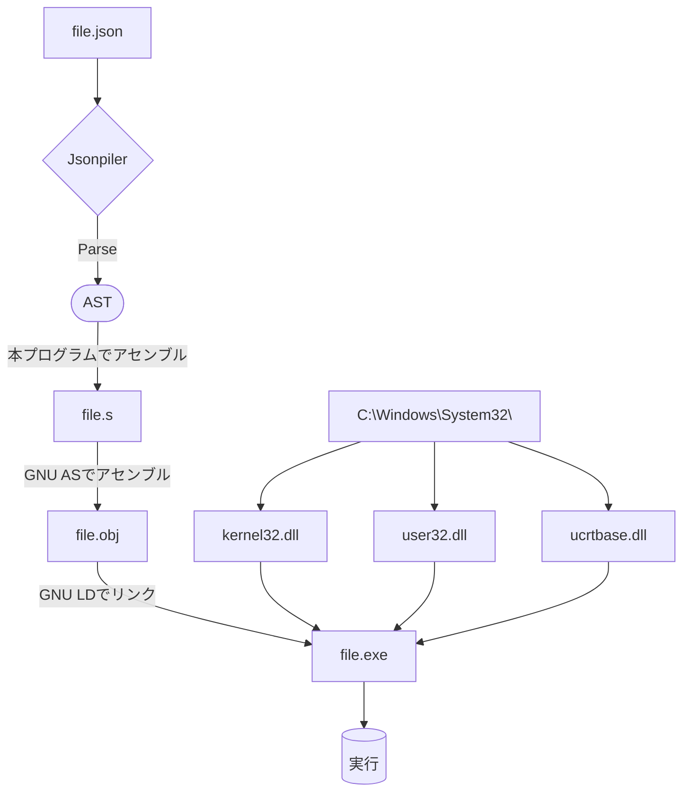

# Jsonpiler - JSON文法プログラミング言語

**Jsonpiler(ジェイソンパイラー)**は  
Jsonとほぼ同様の文法であるプログラミング言語と、  
それを実行可能な.exeファイルに変換するコンパイラです。

このプログラムは、JSONベースのプログラムをGNUアセンブリに変換し、
さらに実行ファイルにGNU AS、GNU LDを使用して結果を実行します。

[英語(English)](https://github.com/HAL-G1THuB/jsonpiler.git/blob/main/README.md)

- [GitHubリポジトリ](https://github.com/HAL-G1THuB/jsonpiler.git)  
- [Crates.io](https://crates.io/crates/jsonpiler)  
- [Docs.rs](https://docs.rs/jsonpiler/latest/jsonpiler)  
- [代替ドキュメント](https://hal-g1thub.github.io/jsonpiler-doc/jsonpiler/index.html)  
- [AI生成ドキュメント](https://deepwiki.com/HAL-G1THuB/jsonpiler)  
🚨 **Windowsでのみ作動します (x64)!** 🚨

## 変更履歴

- **if` 関数の実装**
- **バージョン0.1.6でdocs.rsドキュメントが生成されないことがあった問題を修正し、代替ドキュメントを削除した。**
- **生成されたアセンブリの命令列周りの空白文字をタブに変更。**
- **内容が希薄なドキュメンテーションコメントを削除。**
- **変更履歴とREADMEに日本語版を追加。**
- `bool`型の代入をサポート。
- より保守的で体系的なアセンブリ命令とラベルの生成方法に変更。
[プロジェクトの歴史と計画](https://github.com/HAL-G1THuB/jsonpiler/blob/main/CHANGELOG-ja.md)

## Prerequisites

**以下のツールがインストールされ、PATH環境変数で利用可能であることを確認してください:**

- `ld` (from MinGW-w64)  
- `as` (from MinGW-w64)  

**このプログラムを正常に動作させるためには、以下のDLLがC:Windows/System32/に存在する必要があります。**

- `kernel32.dll`  
- `user32.dll`  
- `ucrtbase.dll`  

## インストールと使用方法

```bash
cargo install jsonpiler
jsonpiler (input_json_file (UTF-8)) [arguments of .exe ...]
```

(input_json_file)`をコンパイルしたい実際のJSONファイルに置き換えてください。

## 例

[例](https://github.com/HAL-G1THuB/jsonpiler/blob/main/examples)

```json
{ "=": ["a", "title"], "message": [{"$": "a"}, "345"] }
```

**実行順序:**

jsonpilerのコードは1つのJSONオブジェクトから構成されます。

式は順番に評価されます。

変数 `"a"` には `"="` を使って文字列 `"title"` が代入されます。

タイトル（変数 `"a"` から）と本文 `"message"` で指定された `"345"` を含むメッセージボックスが表示されます。

プログラムは `{}` ブロックの最終値として、メッセージボックスの中で押されたボタンの ID を整数で返します（現在は `1` のみがサポートされており、C/C++ では `IDOK` に相当します）。

## エラー、もしくは警告メッセージの形式

```json
{ "message": ["タイトル", { "$": "存在しない" }] }
```

```text
Compilation error: Undefined variables: `存在しない`
Error occurred on line: 1
Error position:
{ "message": ["title", { "$": "doesn't_exist" }] }
                              ^^^^^^^^^^^^^^^
```

## 関数一覧

[関数一覧 (マークダウン)](https://github.com/HAL-G1THuB/jsonpiler/blob/main/docs/functions.md)

## 言語仕様

[言語仕様 (マークダウン)](https://github.com/HAL-G1THuB/jsonpiler/blob/main/docs/specification.md)

## 実行のイメージ図


