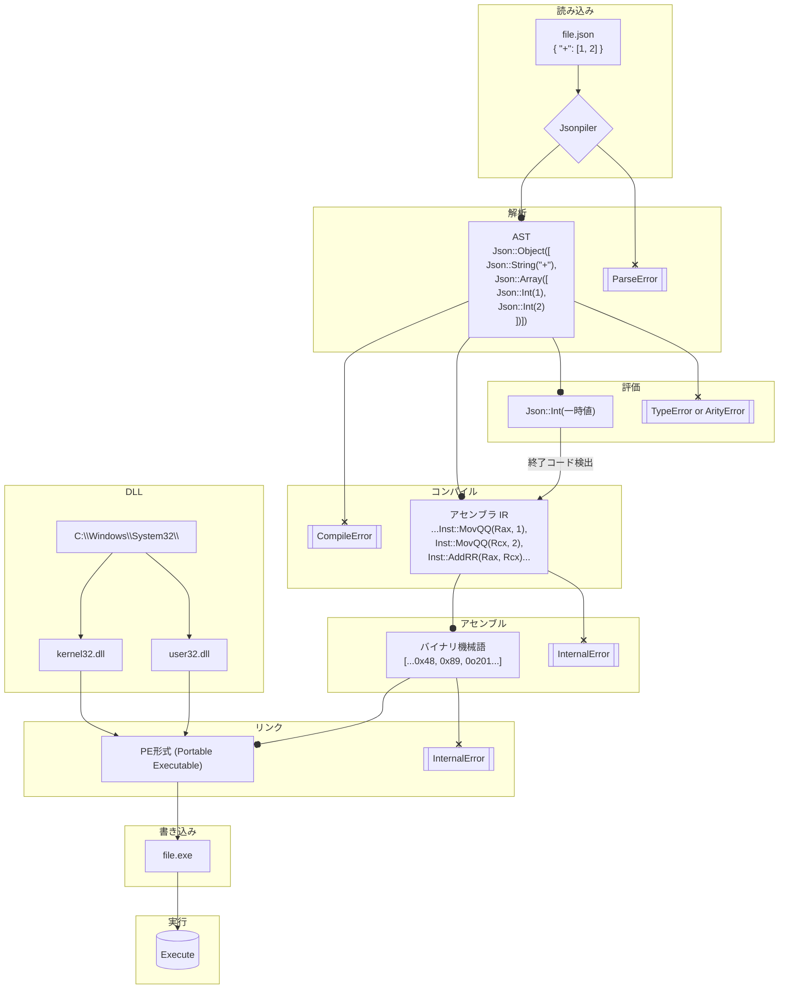

# Jsonpiler — JSON 構文プログラミング言語

[英語(English)](https://github.com/HAL-G1THuB/jsonpiler/blob/main/README-ja.md)

**Jsonpiler** は **JSON** と **JSPL (Jsonpiler Structured Programming Language)** を文法として使うプログラミング言語のコンパイラ兼実行環境です。
JSON で書かれたプログラムを **x86_64 Windows PE** 形式の機械語に変換し、リンクして実行します。
Jsonpiler は、その中間表現（IR）から Windows 用 PE を出力することに特化した **自前実装のアセンブラとリンカ** を内蔵しています。

- [GitHub](https://github.com/HAL-G1THuB/jsonpiler)
- [Crates.io](https://crates.io/crates/jsonpiler)
- [AI 生成ドキュメント: ](https://deepwiki.com/HAL-G1THuB/jsonpiler)
- [VSCode拡張機能](https://marketplace.visualstudio.com/items?itemName=H4LVS.jsplsyntax)

> 🚨 **Windows のみ (x64)** — Jsonpiler は 64 ビット Windows を対象に、ネイティブ PE 実行ファイルを生成します。

---

## 更新情報

### 0.6.5

- 新しい関数を追加: `assert`, `random`, `>`, `>`, `!=`
- モジュールシステムを追加: `include`
- Int型が最小値(0xffffffffffffffff)を正しく扱えるようにしました。
- エラーメッセージのフォーマットを変更。
- `Float`型が`-`関数に渡されたとき正しく符号反転されない問題を修正。
- `abs`関数が`Float`型に対応。
- `print`関数がパイプ、リダイレクトに対応。

詳細は **[CHANGELOG](https://github.com/HAL-G1THuB/jsonpiler/blob/main/CHANGELOG-ja.md)** を参照してください。

---

## 必要条件

外部ツールやライブラリは不要です。

**以下のシステム DLL が `C:\Windows\System32\` に存在する必要があります:**

- `kernel32.dll`
- `user32.dll`

標準的な Windows 環境ではすでに存在します。

---

## インストールと実行

```bash
cargo install jsonpiler

# JSON プログラムをコンパイルして実行
jsonpiler <input.json | input.jspl> [生成exeへの引数]
```

- `<input.json>` は UTF-8 である必要があります。
- 追加の引数は生成された実行ファイルに渡されます。

---

## 言語仕様・関数リファレンス

- **言語仕様 (Markdown)**: [https://github.com/HAL-G1THuB/jsonpiler/blob/main/docs/specification-ja.md](https://github.com/HAL-G1THuB/jsonpiler/blob/main/docs/specification.md)
- **関数リファレンス (Markdown)**: [https://github.com/HAL-G1THuB/jsonpiler/blob/main/docs/functions.md](https://github.com/HAL-G1THuB/jsonpiler/blob/main/docs/functions.md)

---

## 使用例

準備済みサンプルは **`examples/`** にあります:
[https://github.com/HAL-G1THuB/jsonpiler/blob/main/examples](https://github.com/HAL-G1THuB/jsonpiler/blob/main/examples)

最小例:

```json
{ "=": ["a", "title"], "message": [{ "$": "a" }, "345"], "+": [1, 2, 3] }
```

### 実行順序

- Jsonpiler プログラムは単一の JSON オブジェクトで構成され、キーは **順次評価** されます。
- `"="` は文字列 `"title"` を変数 `a` に代入します。
- `"message"` は `a` の値に `"345"` を連結して表示します。
- `"+"` は `1 + 2 + 3` を計算し、結果は **6** です。

プログラムの **最終式の値** はプロセスの **終了コード** になります。Cargo で実行すると次のように表示される場合があります:

```text
error: process didn't exit successfully: `jsonpiler.exe test.json` (exit code: 6)
```

これは Jsonpiler のエラーではなく、想定された動作です。

## JSPL

Jsonpiler は、独自言語である**JSPL (Jsonpiler Structured Programming Language)** をコンパイルできます。
JSPL は、関数定義・条件分岐・関数呼び出し・変数代入などを自然な構文で表現できるよう設計されており、
すべての JSPL コードは内部的に既存の JSON ベースの中間表現（IR）へと変換されるため、
Jsonpiler のコンパイル基盤との完全な互換性を保ちながら、
人にとって書きやすく読みやすい記述が可能になります。
詳細は上記の言語仕様に記載してあります。
上記のサンプルコードをJSPLで記述した例:

```json
a = "title"
message($a, "345")
+(1, 2, 3)
```

| JSPL-JSON の相違点           | JSON                                | JSPL                                    |
| ---------------------------- | ----------------------------------- | --------------------------------------- |
| **波括弧 `{}`**              | 必須                                | トップレベルブロックに限り省略可能      |
| **関数呼び出し構文**         | `{"sum": [1,2,3]}` のような明示形式 | `sum(1, 2, 3)` の自然な関数形式         |
| **識別子記法**               | 全て `"文字列"`                     | `"`を必要としない識別子が使える         |
| **値-識別子-値（三項構文）** | 不可                                | `1 + 10` → `{ "+": [1, 10] }` に変換    |
| **変数参照構文**             | `{"$": "name"}` のような明示形式    | `$name` で記述可能                      |
| **コメント**                 | 不可（仕様上）                      | `# comment`で記述可能                   |
| **制御構文の表現**           | 関数として記述                      | `if(...)`, `define(...)` のような構文糖 |

---

---

## エラー・警告の例

**入力:**

```json
{ "message": ["title", { "$": "doesn't_exist" }] }
```

**出力:**

```text
Compilation error: Undefined variables: `doesn't_exist`
Error occurred on line: 1
Error position:
{ "message": ["title", { "$": "doesn't_exist" }] }
                              ^^^^^^^^^^^^^^^
```

---

## 処理フロー概要



---

## 注意事項

- 出力は Windows x64 向けのネイティブ **PE 実行ファイル** です。
- SEH は現在無効化されており、将来のリリースで再度有効になる可能性があります。
- Cargo 実行時に 0 以外の終了コードが返る場合は、プログラムの最終値によるものです。

---

## ライセンス

ライセンスはリポジトリで確認してください。

---

## 貢献について

Issues や PR は歓迎します。バグを発見した場合は、以下の情報を含めてください。

> 🚨 Windows x64 であることを確認してください。

- JSON プログラム（可能であれば最小限の再現例）
- Jsonpiler のバージョン
