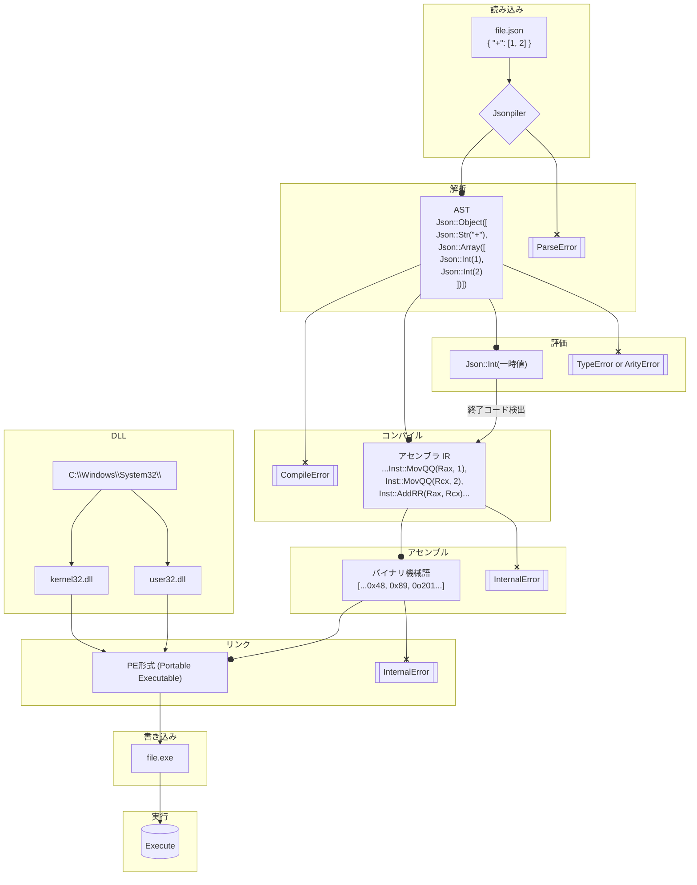

# Jsonpiler — JSON 構文プログラミング言語

[英語(English)](https://github.com/HAL-G1THuB/jsonpiler/blob/main/README-ja.md)

**Jsonpiler** は **JSON** と **JSPL (Jsonpiler Structured Programming Language)** を文法として使うプログラミング言語のコンパイラ兼実行環境です。
JSON で書かれたプログラムを **x86_64 Windows PE** 形式の機械語に変換し、リンクして実行します。
Jsonpiler は、その中間表現（IR）から Windows 用 PE を出力することに特化した **自前実装のアセンブラとリンカ** を内蔵しています。

- [GitHub](https://github.com/HAL-G1THuB/jsonpiler)
- [Crates.io](https://crates.io/crates/jsonpiler)
- [AI 生成ドキュメント: ](https://deepwiki.com/HAL-G1THuB/jsonpiler)
- [VSCode 拡張機能](https://marketplace.visualstudio.com/items?itemName=H4LVS.jsplsyntax)

> 🚨 **Windows のみ (x64)** — Jsonpiler は 64 ビット Windows を対象に、ネイティブ PE 実行ファイルを生成します。

---

## GUI

Jsonpilerに GUI をサポートする関数が追加されました。


[Jsonpilerで描画されたマンデルブロ集合のズーム](https://youtu.be/M8wEPkHmYdE)

[ジュリア集合をGUIで描くプログラムのソースコード](https://github.com/HAL-G1THuB/jsonpiler/blob/main/examples/jspl/gui_julia_mouse.jspl)

[マンデルブロ集合をGUIで描くプログラムのソースコード](https://github.com/HAL-G1THuB/jsonpiler/blob/main/examples/jspl/gui_mandelbrot_zoom.jspl)

---

## 更新情報

### 0.9.0

- 追加
  - コマンド: `format`, `server`, `release`
  - 新しい関数: `export`, `confirm`, `main`, `<<`, `>>`, `slice`
  - `Str`における`==`と`!=`を追加
  - フォーマット機能とエラーを診断するLSPサーバー機能
  - `let`(variable = value) によるローカル変数定義
  - `global`(variable = value) によるグローバル変数定義
  - 比較関数が`Float`に対応
  - 演算子優先順位
  - 拡張機能内の JSPL 言語サーバー
  - 拡張機能内の `Run JSPL`

- 変更
  - `include` -> `import`
  - 関数名と変数名の衝突が許されなくなった
  - `import`には対象ファイル内で`export`が必要になった
  - 変数の定義と再代入の構文を分離
  - `=` を再代入専用に
  - 1つのみの`if([cond, any])`の`[]`を省略できるように
  - `concat`がリテラル以外も結合するように
  - 予期しないメモリリークを実行時に検知するように
    (メモリリークは仕様として想定されていない)
  - `import`で他のファイルを読み込む際、初回読み込み時ではなく、
    スタートアップ時に実行されるように
  - 未使用の変数、引数、関数に警告を出すように
    この警告は、変数の先頭に`_`をつけることで回避できる
  - `len`が文字列のバイト長ではなく文字の数を表すように。
  - `GUI`によって呼ばれる関数名がウィンドウのタイトルバーに表示されるように
  - 使用したユーザー定義関数とその内部で使用する関数のみをリンクするように
  - 非リリースビルド時に算術演算のオーバーフローに対してエラーを出すように
  - JSPLの引数と`Array`が末尾のトレーリングカンマを許すように
  - 空のJSPLファイルが`null`を意味するようになった

- 削除
  - JSPLの変数先頭の`$`
  - cargo doc
  - 関数: `'`, `eval`

詳細は **[CHANGELOG](https://github.com/HAL-G1THuB/jsonpiler/blob/main/CHANGELOG-ja.md)** を参照してください。

---

## 必要条件

外部ツールやライブラリは不要です。

**以下のシステム DLL が `C:\Windows\System32\` に存在する必要があります:**

- `gdi32.dll`(`GUI`など)
- `kernel32.dll`(必須)
- `user32.dll`(`message`, `GUI`など)

標準的な Windows 環境ではすでに存在します。

---

## インストールと実行

### JSPLを実行する場合

//拡張機能についての説明

- [VSCode 拡張機能](https://marketplace.visualstudio.com/items?itemName=H4LVS.jsplsyntax)をインストールします。
- `.jspl` ファイルを作成し、エディタ右上の `Run JSPL` ボタンをクリックすることで実行できます。

### 直接実行ファイルを動かす場合

#### Githubリポジトリから

```bash
git clone "https://github.com/HAL-G1THub/jsonpiler.git"
cd "jsonpiler/extension/bin"
jsonpiler.exe
```

#### cargoから

```bash
cargo install jsonpiler
cd "<ホームディレクトリ>/.cargo/bin"
jsonpiler.exe
```

#### 実行

```bash
# JSON | JSPL プログラムをコンパイルして実行
jsonpiler "<input.json | input.jspl>" "[生成exeへの引数]"
```

- `<input.json | input.jspl>` のファイルエンコーディングは
    UTF-8 である必要があります。
- 追加の引数は生成された実行ファイルに渡されます。

---

## 言語仕様・関数リファレンス

[**言語仕様 (Markdown)**](https://github.com/HAL-G1THuB/jsonpiler/blob/main/docs/specification-ja.md)
[**関数リファレンス (Markdown)**](https://github.com/HAL-G1THuB/jsonpiler/blob/main/docs/functions/README.md)

---

## 例

準備済みサンプルは [examples/](https://github.com/HAL-G1THuB/jsonpiler/blob/main/examples) にあります。

コード例:

```json
{
  "=": [{ "$": "a" }, "title"],
  "message": [{ "$": "a" }, "345"],
  "+": [1, 2, 3]
}
```

```jspl
a = "title"
message(a, "345")
1 + 2 + 3
```

### 実行順序

- Jsonpiler プログラムは単一の JSON オブジェクトで構成され、キーは **順次評価** されます。
- `"="` は文字列 `"title"` を変数 `a` に代入します。
- `"message"` は `a` の値をタイトルとし、
  `"345"` をテキストとしたメッセージボックスを表示します。
- `"+"` は `1 + 2 + 3` を計算し、結果は **6** です。

プログラムの **最終式の値** はプロセスの **終了コード** になります。

Cargo で実行すると次のように表示される場合があります:

```text
error: process didn't exit successfully: `jsonpiler.exe test.json` (exit code: 6)
```

これは Jsonpiler のエラーではなく、想定された動作です。

## JSPL

Jsonpiler は、独自言語である**JSPL (Jsonpiler Structured Programming Language)** をコンパイルできます。
JSPL は、関数定義・条件分岐・関数呼び出し・変数代入などを自然な構文で表現できるよう設計されており、
すべての JSPL コードは内部的に既存の JSON ベースの中間表現（IR）へと変換されるため、
Jsonpiler のコンパイル基盤との完全な互換性を保ちながら、
人にとって書きやすく読みやすい記述が可能になります。
詳細は上記の言語仕様に記載してあります。
上記のサンプルコードを JSPL で記述した例:

```jspl
a = "title"
message($a, "345")
+(1, 2, 3)
```

---

## エラー・警告の例

**入力:**

```json
{ "message": ["title", { "$": "does_not_exist" }] }
```

```jspl
message("title", does_not_exist)
```

**出力:**

```text
╭- CompilationError ----------
| Undefined variable:
|   does_not_exist
|-----------------------------
| input.jspl:1:18
|-----------------------------
| message("title", does_not_exist)
|                  ^^^^^^^^^^^^^^
╰-----------------------------
```

---

## 処理フロー概要


```mermaid
graph TD
  subgraph 読み込み
    A["file.json\n{ &quot;+&quot;: [1, 2] }"] --> B{Jsonpiler}
  end
  subgraph 解析
    B --o C["AST\nJson::Object([
      Json::Str(&quot;+&quot;),
      Json::Array([
        Json::Int(1),
        Json::Int(2)
      ])])"]
    B --x PError[[ParseError]]
  end
  subgraph コンパイル
    C --x CError[[CompileError]]
    C --o E["アセンブラ IR
    ...Inst::MovQQ(Rax, 1),
    Inst::MovQQ(Rcx, 2),
    Inst::AddRR(Rax, Rcx)..."]
  end
  subgraph 評価
    C --o D["Json::Int(一時値)"]
    C --x EError[[TypeError or ArityError]]
    D -->|終了コード検出| E
  end
  subgraph アセンブル
    E --o G["バイナリ機械語
    [...0x48, 0x89, 0o201...]"]
    E --x AError[[InternalError]]
  end
  subgraph リンク
    G --o F["PE形式 (Portable Executable)"]
    G --x LError[[InternalError]]
  end
  subgraph 書き込み
    F --> H[file.exe]
  end
  subgraph 実行
    H --> Exec[(Execute)]
  end
  subgraph DLL
    S[C:\\Windows\\System32\\]
    KERNEL32[kernel32.dll]
    USER32[user32.dll]
    S --> KERNEL32 --> F
    S --> USER32 --> F
  end
```

---

## 注意事項

- 出力は Windows x64 向けのネイティブ **PE 実行ファイル** です。
- Cargo 実行時に 0 以外の終了コードが返る場合は、プログラムの最終値によるものです。

---

## ライセンス

ライセンスはリポジトリで確認してください。

---

## 貢献について

Issues や PR は歓迎します。バグを発見した場合は、以下の情報を含めてください。

> 🚨 Windows x64 であることを確認してください。

- JSON プログラム（可能であれば最小限の再現例）
- Jsonpiler のバージョン
