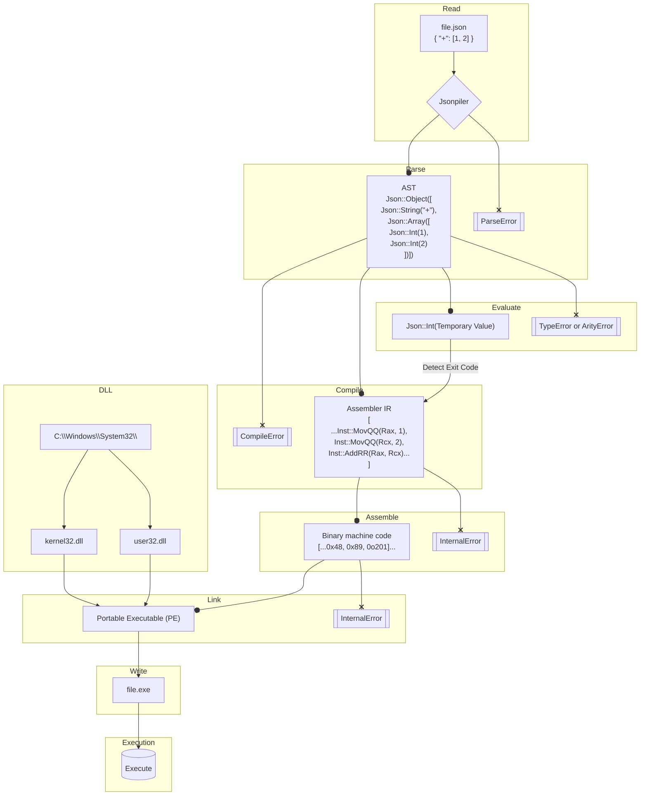

# Jsonpiler — JSON Syntax Programming Language

**Jsonpiler** is a compiler and runtime for a programming language that uses **JSON** as its syntax.  It converts a JSON-based program into **x86\_64 Windows PE** machine code, links it, and executes the result.
Jsonpiler bundles an assembler and linker purpose-built for its IR and PE output on Windows.

[日本語 README](https://github.com/HAL-G1THuB/jsonpiler/blob/main/README-ja.md)

- GitHub: [https://github.com/HAL-G1THuB/jsonpiler](https://github.com/HAL-G1THuB/jsonpiler)
- Crates.io: [https://crates.io/crates/jsonpiler](https://crates.io/crates/jsonpiler)
- AI-generated docs: [https://deepwiki.com/HAL-G1THuB/jsonpiler](https://deepwiki.com/HAL-G1THuB/jsonpiler)

> 🚨 **Windows only (x64)** — Jsonpiler targets 64-bit Windows and produces native PE executables.

---

## What’s New

### 0.5.4

- Added `.bin binary` in .gitattributes
- Fixed a critical bug in 0.5.0
- Fixed an issue where some `mov` instructions using values ≥ 32-bit caused assembler errors.
- **Built-in assembler and linker**: GNU `as` and `ld` are no longer required.
- No transient `.s` or `.obj` files are produced during builds.
- SEH support is **temporarily disabled**.

See **[CHANGELOG](https://github.com/HAL-G1THuB/jsonpiler/blob/main/CHANGELOG.md)** for full history and plans.

---

## Requirements

No external toolchains or libraries are required.

**The following system DLLs must be available in `C:\\Windows\\System32\\`:**

- `kernel32.dll`
- `user32.dll`

These are present on standard Windows installations.

---

## Install & Run

```bash
cargo install jsonpiler

# Compile and execute a JSON program
jsonpiler <input.json> [args passed to the produced .exe]
```

- `<input.json>` must be UTF-8 encoded.
- Any additional arguments are forwarded to the generated executable at runtime.

---

## Language & Function References

- **Language Spec (Markdown):** [https://github.com/HAL-G1THuB/jsonpiler/blob/main/docs/specification.md](https://github.com/HAL-G1THuB/jsonpiler/blob/main/docs/specification.md)
- **Function Reference (Markdown):** [https://github.com/HAL-G1THuB/jsonpiler/blob/main/docs/functions.md](https://github.com/HAL-G1THuB/jsonpiler/blob/main/docs/functions.md)

---

## Examples

Browse ready-to-run samples in **`examples/`**:
[https://github.com/HAL-G1THuB/jsonpiler/blob/main/examples](https://github.com/HAL-G1THuB/jsonpiler/blob/main/examples)

Minimal example:

````json
{ "=": ["a", "title"], "message": [{"$": "a"}, "345"], "+": [1, 2, 3] }
``;

**Execution order**
- A Jsonpiler program is a single JSON object whose keys are evaluated **sequentially**.
- `"="` assigns the string `"title"` to the variable `a`.
- `"message"` prints the value of `a` followed by `"345"`.
- `"+"` computes the sum of `1`, `2`, and `3`, i.e., **6**.

The program’s **final expression value** becomes the process **exit code**. Running under `cargo run` may look like this (Windows reports process exit code 6):

```text
error: process didn't exit successfully: `jsonpiler.exe test.json` (exit code: 6)
````

This is expected behavior and not an error in Jsonpiler itself.

---

## Diagnostics (Errors & Warnings)

**Input:**

```json
{ "message": ["title", { "$": "doesn't_exist" }] }
```

**Output:**

```text
Compilation error: Undefined variables: `doesn't_exist`
Error occurred on line: 1
Error position:
{ "message": ["title", { "$": "doesn't_exist" }] }
                              ^^^^^^^^^^^^^^^
```

---

## Pipeline Overview



---

## Notes

- Output is a native **PE executable** for Windows x64.
- SEH is currently disabled and may be re-enabled in a future release.
- If you see a non-zero exit code under Cargo, it likely reflects your program’s final value.

---

## License

This project’s license is specified in the repository.

---

## Contributing

Issues and PRs are welcome! If you find a bug, please include the following information:

> 🚨 Please make sure you are running on Windows x64.

- The JSON program (minimal reproduction if possible)
- Jsonpiler version

---
