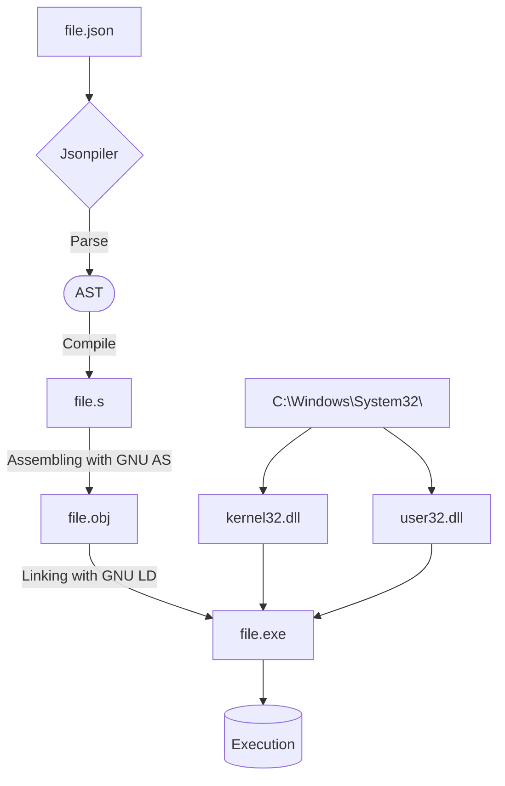

# Jsonpiler - JSON Syntax Programming Language

**Jsonpiler** is a compiler for the JSON syntax programming language and its compiler.

This program converts a JSON-based program to GNU assembly, compiles it, and executes the result.  

[Japanese(日本語)](https://github.com/HAL-G1THuB/jsonpiler/blob/main/README-ja.md)

- [GitHub repository](https://github.com/HAL-G1THuB/jsonpiler)  
- [Crates.io](https://crates.io/crates/jsonpiler)  
- [Docs.rs](https://docs.rs/jsonpiler/latest/jsonpiler)  
- [AI-generated Docs ](https://deepwiki.com/HAL-G1THuB/jsonpiler)  
🚨 **This program only runs on Windows (x64)!** 🚨

## What's New

- **Limiting input files to 1 GB or less eliminates unnecessary safety checks in the parser and speeds up the process.**
- **Changed the way assembly instructions are stored, improving processing speed and memory efficiency.**
- **Eliminated dependence on c functions (malloc, free), making `ucrtbase.dll` unnecessary.**
- **Split the documentation of built-in functions into several files because they became bloated.**
- **The timing of releasing a temporary value passed as an argument of a function not bound to a variable is now fixed at the end of the function. (Exception: the last temporary value of the body of `if` is released.)**
- **The argument format of `if`, `scope`, and `lambda` has been changed.**
- **A new function `value` has been added. This function returns the given evaluated value as-is and is used to add a literal to the end of an Object's instruction sequence.**
- Added new function: `not`, `xor`, `or`, and `and`.
- The built-in functions have become bloated and have been split into multiple files.
- Changed bool type memory area from 1bit to 1byte due to expected large performance degradation due to instruction bloat
- Intuitive function argument validation.

[Project History and Plans](https://github.com/HAL-G1THuB/jsonpiler/blob/main/CHANGELOG.md)

## Prerequisites

**Make sure the following tools are installed and available in your PATH environment variable:**

- `ld` (from MinGW-w64)  
- `as` (from MinGW-w64)  

**The following DLLs must be present in `C:\Windows\System32\` for the program to work correctly:**

- `kernel32.dll`  
- `user32.dll`  

## Installation & Usage

```bash
cargo install jsonpiler
jsonpiler (input_json_file (UTF-8)) [arguments of .exe ...]
```

Replace `(input_json_file)` with the actual JSON file you want to compile.

## Example

[Examples](https://github.com/HAL-G1THuB/jsonpiler/blob/main/examples)

```json
{ "=": ["a", "title"], "message": [{"$": "a"}, "345"] }
```

**Execution order:**

The jsonpiler code consists of a single JSON object.

Expressions are evaluated sequentially.

The variable `"a"` is assigned the string `"title"` using `"="`.

A message box appears with the title (from the variable `"a"`) and the body `"345"` as specified by `"message"`.

The program returns the integer ID of the button pressed in the message box (currently only `1` is supported, which corresponds to `IDOK` in C/C++), as the final value of the `{}` block.

## Error or warning message format

```json
{ "message": ["title", { "$": "doesn't_exist" }] }
```

```text
Compilation error: Undefined variables: `doesn't_exist`
Error occurred on line: 1
Error position:
{ "message": ["title", { "$": "doesn't_exist" }] }
                              ^^^^^^^^^^^^^^^
```

## Function Documentation

[Function Reference (Markdown)](https://github.com/HAL-G1THuB/jsonpiler/blob/main/docs/functions.md)

## Language Documentation

[Language Reference (Markdown)](https://github.com/HAL-G1THuB/jsonpiler/blob/main/docs/specification.md)

## Execution


