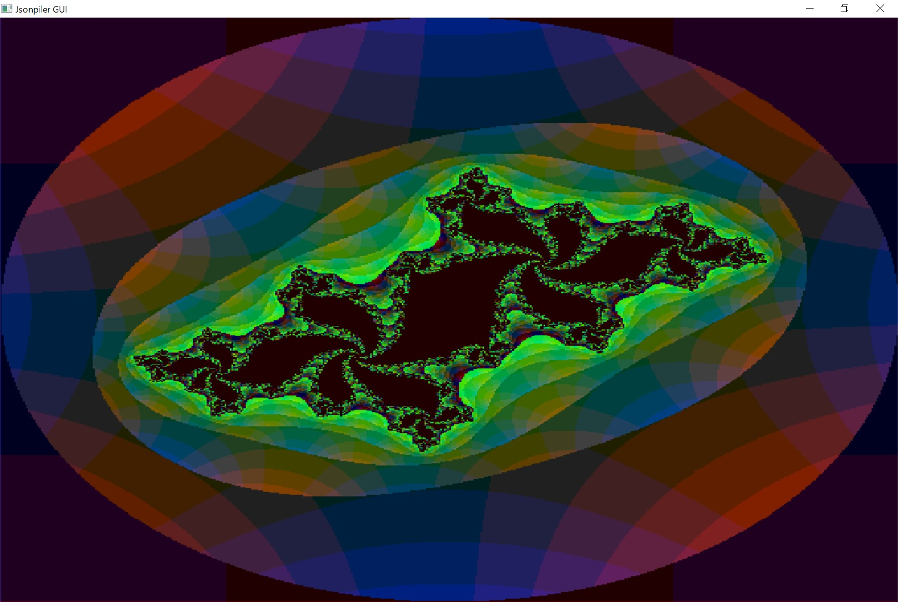
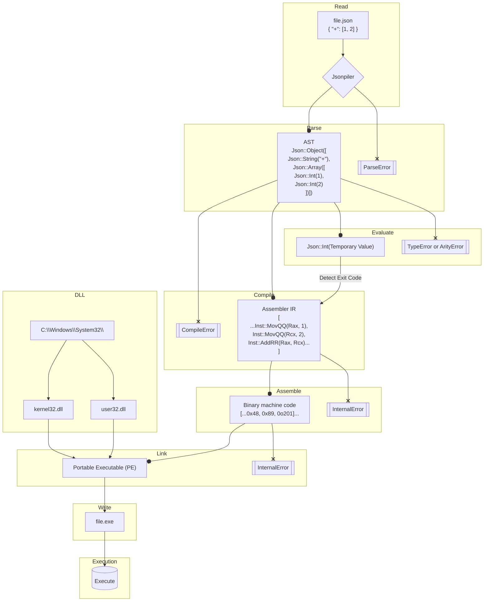

# Jsonpiler — JSON Syntax Programming Language

**Jsonpiler** is a compiler and runtime for a programming language that uses **JSON** or **JSPL (Jsonpiler Structured Programming Language)** as its syntax.  It converts a JSON-based program into **x86\_64 Windows PE** machine code, links it, and executes the result.
Jsonpiler bundles an assembler and linker purpose-built for its IR and PE output on Windows.

[日本語 README](https://github.com/HAL-G1THuB/jsonpiler/blob/main/README-ja.md)

- [GitHub](https://github.com/HAL-G1THuB/jsonpiler)
- [Crates.io](https://crates.io/crates/jsonpiler)
- [AI-generated docs: ](https://deepwiki.com/HAL-G1THuB/jsonpiler)
- [VSCode Extensions](https://marketplace.visualstudio.com/items?itemName=H4LVS.jsplsyntax)

> 🚨 **Windows only (x64)** — Jsonpiler targets 64-bit Windows and produces native PE executables.

---

## GUI

Jsonpiler now has a function to support GUI.



[Zoom of the Mandelbrot set drawn by Jsonpiler](https://youtu.be/M8wEPkHmYdE)

[Source code of the program to draw the Julia set with GUI](https://github.com/HAL-G1THuB/jsonpiler/blob/main/examples/jspl/gui_julia_mouse.jspl)

[Source code of the program to draw the Mandelbrot set with GUI](https://github.com/HAL-G1THuB/jsonpiler/blob/main/examples/jspl/gui_mandelbrot_zoom.jspl)

---

## What’s New

### 0.7.0

- `global` is now reassignable.
- `global` is now thread-safe.
- GUI feature added: `GUI`.
- jspl supports new notation: `1 + 10 + 1` is now interpreted as `+(1, 10, 1)`.
- Semicolons are now required when writing multiple function calls on the same line in jspl.

See **[CHANGELOG](https://github.com/HAL-G1THuB/jsonpiler/blob/main/CHANGELOG.md)** for full history and plans.

---

## Requirements

No external toolchains or libraries are required.

**The following system DLLs must be available in `C:\\Windows\\System32\\`:**

- `kernel32.dll`
- `user32.dll`

These are present on standard Windows installations.

---

## Install & Run

```bash
cargo install jsonpiler

# Compile and execute a JSON program
jsonpiler <input.json | input.jspl> [args passed to the produced .exe]
```

- `<input.json>` must be UTF-8 encoded.
- Any additional arguments are forwarded to the generated executable at runtime.

---

## Language & Function References

[Language Spec (Markdown)](https://github.com/HAL-G1THuB/jsonpiler/blob/main/docs/specification.md)

[Function Reference (Markdown)](https://github.com/HAL-G1THuB/jsonpiler/blob/main/docs/functions.md)

---

## Examples

Browse ready-to-run samples in [examples/](https://github.com/HAL-G1THuB/jsonpiler/blob/main/examples)

Minimal example:

```json
{ "=": ["a", "title"], "message": [{"$": "a"}, "345"], "+": [1, 2, 3] }
```

### Execution order

- A Jsonpiler program is a single JSON object whose keys are evaluated **sequentially**.
- `"="` assigns the string `"title"` to the variable `a`.
- `"message"` prints the value of `a` followed by `"345"`.
- `"+"` computes the sum of `1`, `2`, and `3`, i.e., **6**.

The program’s **final expression value** becomes the process **exit code**. Running under `cargo run` may look like this (Windows reports process exit code 6):

```text
error: process didn't exit successfully: `jsonpiler.exe test.json` (exit code: 6)
```

This is expected behavior and not an error in Jsonpiler itself.

---

## JSPL

Jsonpiler can compile its own language, **JSPL (Jsonpiler Structured Programming Language)**.
JSPL is designed to express function definitions,conditionals,
function calls, and variable assignments in a natural and intuitive form.
All JSPL code is internally transformed into the same JSON-based intermediate representation (IR),
ensuring full compatibility with the existing Jsonpiler compilation infrastructure
while making programs easier to write and understand.
For more details, see the language specification above.
Example of the above sample code written in JSPL:

```jspl
a = "title"
message($a, "345")
+(1, 2, 3)
```

| Differences from JSON         | JSON                                  | JSPL                                          |
| ----------------------------- | ------------------------------------- | --------------------------------------------- |
| **Curly braces `{}`**         | Required                              | Optional for top-level blocks                 |
| **Function call syntax**      | Explicit form like `{"sum": [1,2,3]}` | Natural syntax like `sum(1, 2, 3)`            |
| **Identifier notation**       | All keys must be quoted `"string"`    | Unquoted identifiers are allowed              |
| **Infix notation**      | Not supported                         | `1 + 10` → expanded to `{ "+": [1, 10] }`     |
| **Variable reference syntax** | Explicit form like `{"$": "name"}`    | Can be written as `$name`                     |
| **Comments**                  | Not allowed (by spec)                 | Supported via `# comment`                     |

---

## Diagnostics (Errors & Warnings)

**Input:**

```json
{ "message": ["title", { "$": "doesn't_exist" }] }
```

**Output:**

```text
Compilation error: Undefined variables: `doesn't_exist`
Error occurred on line: 1
Error position:
{ "message": ["title", { "$": "doesn't_exist" }] }
                              ^^^^^^^^^^^^^^^
```

---

## Pipeline Overview



---

## Notes

- Output is a native **PE executable** for Windows x64.
- SEH is currently disabled and may be re-enabled in a future release.
- If you see a non-zero exit code under Cargo, it likely reflects your program’s final value.

---

## License

This project’s license is specified in the repository.

---

## Contributing

Issues and PRs are welcome! If you find a bug, please include the following information:

> 🚨 Please make sure you are running on Windows x64.

- The JSON program (minimal reproduction if possible)
- Jsonpiler version

---
