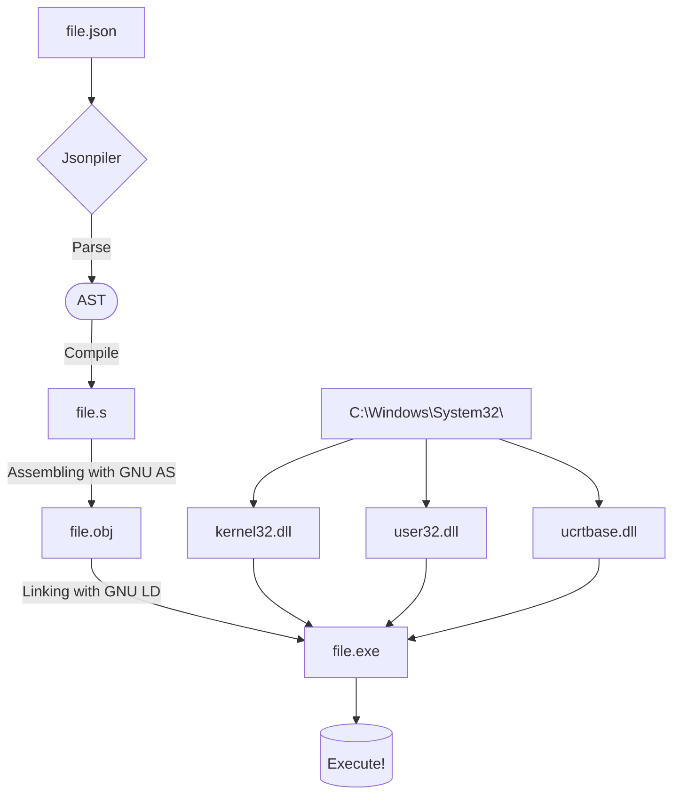

# Jsonpiler - JSON Syntax Programming Language

**Jsonpiler** is a compiler for the JSON syntax programming language and its compiler.

This program converts a JSON-based program to GNU assembly, compiles it, and executes the result.  

- [GitHub repository](https://github.com/HAL-G1THuB/jsonpiler.git)  
- [Crates.io](https://crates.io/crates/jsonpiler)  
- [Docs.rs](https://docs.rs/jsonpiler/latest/jsonpiler)  
- [Fallback documentation (if docs.rs fails)](https://hal-g1thub.github.io/jsonpiler-doc/jsonpiler/index.html)  
🚨 **This program only runs on Windows (x64)!** 🚨

## What's New

- **Added functionality to cache and reuse string literals**.
- **Generalized variable generation in assembly**.
- **Significantly renamed structures for clarity**.
- Significantly improved parser slowness caused by changes in the previous version
- Added the ability to dynamically change stack allocations (currently unused)
- The format of the error statement was fixed.

[CHANGELOG (Markdown)](https://github.com/HAL-G1THuB/jsonpiler/tree/main/CHANGELOG.md)

## Prerequisites

**Make sure the following tools are installed and available in your PATH environment variable:**

- `ld` (from MinGW-w64)  
- `as` (from MinGW-w64)  

**The following DLLs must be present in `C:\Windows\System32\` for the program to work correctly:**

- `kernel32.dll`  
- `user32.dll`  
- `ucrtbase.dll`  

## Installation & Usage

```bash
cargo install jsonpiler
jsonpiler (input_json_file (UTF-8)) [arguments of .exe ...]
```

Replace `(input_json_file)` with the actual JSON file you want to compile.

## Example

```json
["begin", ["=", "a", "title"], ["message", ["$", "a"], "345"]]
```

**Execution order:**

The jsonpiler code consists of a single JSON object.

Expressions within `begin` are evaluated sequentially.

The variable `"a"` is assigned the string `"title"` using `"="`.

A message box appears with the title (from the variable `"a"`) and the body `"345"` as specified by `"message"`.

The program returns the integer ID of the button pressed in the message box (currently only `1` is supported, which corresponds to `IDOK` in C/C++), as the final value of the `begin` block.

## Error message

```json
["message", "title", ["$", "not_exist"]]
```

```text
Compilation error: Undefined variables: `not_exist`
Error occurred on line: 1
Error position:
["message", "title", ["$", "not_exist"]]
                           ^
```

## Function Documentation

[Function Reference (Markdown)](https://github.com/HAL-G1THuB/jsonpiler/tree/main/docs/functions.md)

## Language Documentation

[Language Reference (Markdown)](https://github.com/HAL-G1THuB/jsonpiler/tree/main/docs/specification.md)

## Execution


