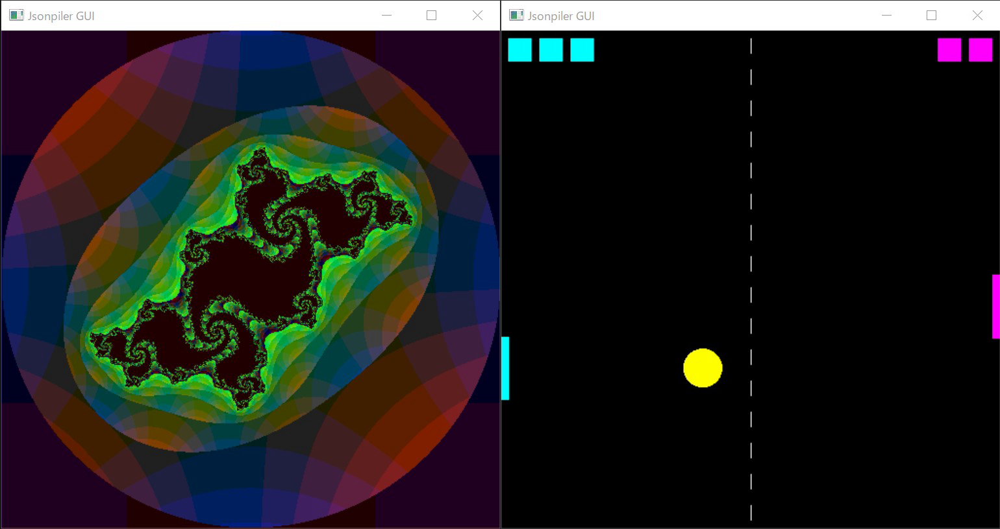
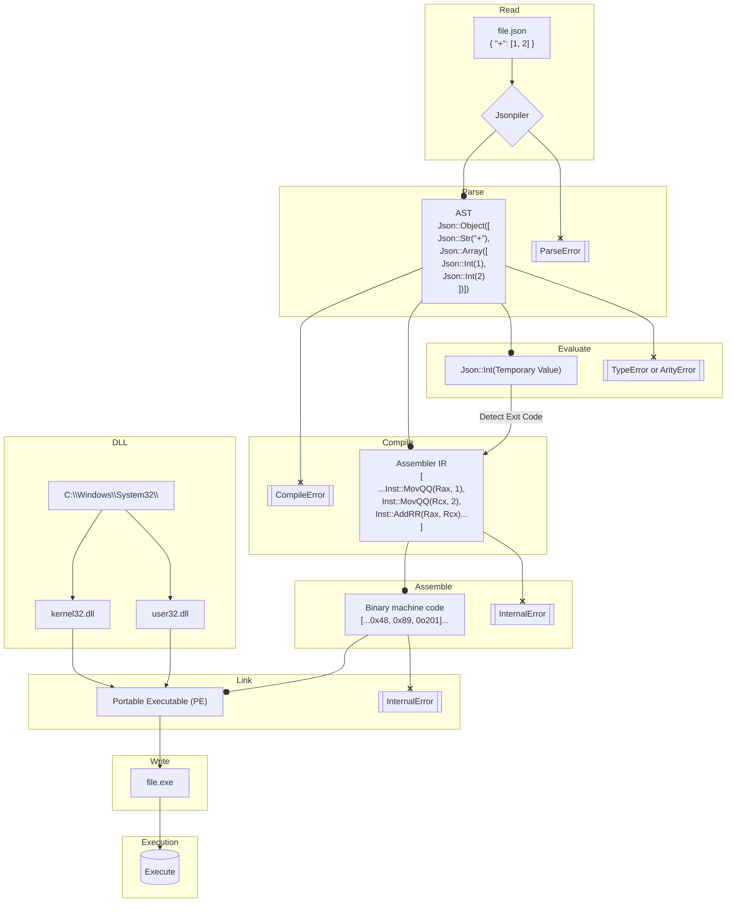

# Jsonpiler — JSON Syntax Programming Language

**Jsonpiler** is a compiler and runtime for a programming language that uses **JSON** or **JSPL (Jsonpiler Structured Programming Language)** as its syntax.  
It converts a JSON-based program into **x86_64 Windows PE** machine code, links it, and executes the result.
Jsonpiler bundles an assembler and linker purpose-built for its IR and PE output on Windows.

[日本語 README](https://github.com/HAL-G1THuB/jsonpiler/blob/main/README-ja.md)

- [GitHub](https://github.com/HAL-G1THuB/jsonpiler)
- [Crates.io](https://crates.io/crates/jsonpiler)
- [AI-generated docs: ](https://deepwiki.com/HAL-G1THuB/jsonpiler)
- [VSCode Extensions](https://marketplace.visualstudio.com/items?itemName=H4LVS.jsplsyntax)

> 🚨 **Windows only (x64)** — Jsonpiler generates PE (Portable Executable) files for 64-bit Windows.

## GUI

Jsonpiler now has a function to support GUI.



[Zoom of the Mandelbrot set drawn by Jsonpiler](https://youtu.be/M8wEPkHmYdE)

[Source code of the program to draw the Julia set with GUI](https://github.com/HAL-G1THuB/jsonpiler/blob/main/examples/jspl/gui_julia_mouse.jspl)

[Source code of the program to draw the Mandelbrot set with GUI](https://github.com/HAL-G1THuB/jsonpiler/blob/main/examples/jspl/gui_mandelbrot_zoom_scroll.jspl)

## What’s New

### 0.10.0

- Added
  - Released JsonpilerExtension v0.2.0, compatible with this version
  - The LSP server now processes minor code changes in batches
  - Added hover functionality to the LSP server
  - Added definition and reference navigation to the LSP server
  - The LSP server now releases resources for closed files
  - Formatted LSP server logs
  - The LSP server now returns function documentation when hovering over built-in functions

- Fixed
  - Formatter error with the unary `-` operator

- Removed
  Removed `concat` and merged it into `+` and `+=`

See **[CHANGELOG](https://github.com/HAL-G1THuB/jsonpiler/blob/main/CHANGELOG.md)** for full history and plans.

## Requirements

No external toolchains or libraries are required.

**The following system DLLs must be available in `C:\\Windows\\System32\\`:**

- `gdi32.dll`(`GUI`, etc.)
- `kernel32.dll`(required)
- `user32.dll`(`message`, `GUI`, etc.)

These are present on standard Windows installations.

## Extensions

Extensions are available to help you write JSPL comfortably in VSCode.

- **LSP Support**: Provides real-time error detection and formatting features.
- **Auto-formatting**: Formats your code to keep it easy to read.
- **Syntax highlighting**: Highlights JSPL keywords and operators in different colors.
- **Run Button**: Run your program with a single click using the button in the top-right corner of the editor.

[VSCode Marketplace](https://marketplace.visualstudio.com/items?itemName=H4LVS.jsplsyntax)

## Installation and Execution

### Running JSPL

- Install the [VSCode extension](https://marketplace.visualstudio.com/items?itemName=H4LVS.jsplsyntax).
- Create a `.jspl` file, then click the `Run JSPL` button in the top-right corner of the editor to execute it.

### Running the Executable Directly

#### From the GitHub Repository

```bash
git clone "https://github.com/HAL-G1THub/jsonpiler.git"
cd "./jsonpiler/extension/bin"
jsonpiler.exe
```

#### From Cargo

```bash
cargo install jsonpiler
cd "<home directory>/.cargo/bin"
jsonpiler.exe
```

#### Execution

```bash
# Compile and run a JSON | JSPL program
jsonpiler "<input.json | input.jspl>" "[arguments for generated exe]"
```

- The file encoding of `<input.json | input.jspl>` must be UTF-8.
- Additional arguments are passed to the generated executable.

## Language & Function References

[Language Spec (Markdown)](https://github.com/HAL-G1THuB/jsonpiler/blob/main/docs/specification.md)

[Function Reference (Markdown)](https://github.com/HAL-G1THuB/jsonpiler/blob/main/docs/functions/README.md)

## Examples

Browse ready-to-run samples in [examples/](https://github.com/HAL-G1THuB/jsonpiler/blob/main/examples)

Minimal example:

```json
{
  "=": [{ "$": "a" }, "title"],
  "message": [{ "$": "a" }, "345"],
  "+": [1, 2, 3]
}
```

JSPL:

```jspl
a = "title"
message(a, "345")
1 + 2 + 3
```

### Execution order

- A Jsonpiler program is a single JSON object whose keys are evaluated **sequentially**.
- `"="` assigns the string `"title"` to the variable `a`.
- `"message"` displays a message box
  with the value of `a` as the title and `"345"` as the text.
- `"+"` computes the sum of `1`, `2`, and `3`, i.e., **6**.

The program’s **final expression value** becomes the process **exit code**. Running under `cargo run` may look like this (Windows reports process exit code 6):

```text
error: process didn't exit successfully: `jsonpiler.exe test.json` (exit code: 6)
```

This is expected behavior and not an error in Jsonpiler itself.

## Diagnostics (Errors & Warnings)

**Input:**

```json
{ "message": ["title", { "$": "does_not_exist" }] }
```

```jspl
message("title", does_not_exist)
```

**Output:**

```text
╭- CompilationError ----------
| Undefined variable:
|   does_not_exist
|-----------------------------
| input.jspl:1:18
|-----------------------------
| message("title", does_not_exist)
|                  ^^^^^^^^^^^^^^
╰-----------------------------
```

## Pipeline Overview


```mermaid
graph TD
  subgraph Read
    A["file.json
{ &quot;+&quot;: [1, 2] }"] --> B{Jsonpiler}
  end
  subgraph Parse
    B --o C["AST
Json::Object([
  Json::Str(&quot;+&quot;),
  Json::Array([
    Json::Int(1),
    Json::Int(2)
])])"]
    B --x PError[[ParseError]]
  end
  subgraph Compile
    C --x CError[[CompileError]]
    C --o E["Assembler IR
[
  ...Inst::MovQQ(Rax, 1),
  Inst::MovQQ(Rcx, 2),
  Inst::AddRR(Rax, Rcx)...
]"]
  end
  subgraph Evaluate
    C --o D["Json::Int(Temporary Value)"]
    C --x EError[[TypeError or ArityError]]
    D -->|Detect Exit Code| E
  end
  subgraph Assemble
    E --o G["Binary machine code
  [...0x48, 0x89, 0o201]..."]
    E --x AError[[InternalError]]
  end
  subgraph Link
    G --o F["Portable Executable (PE)"]
    G --x LError[[InternalError]]
  end
  subgraph Write
    F --> H[file.exe]
  end
  subgraph Execution
    H --> Exec[(Execute)]
  end
  subgraph DLL
    S[C:\\Windows\\System32\\]
    KERNEL32[kernel32.dll]
    USER32[user32.dll]
    S --> KERNEL32 --> F
    S --> USER32 --> F
  end
```

## Notes

- Output is a native **PE executable** for Windows x64.
- If you see a non-zero exit code under Cargo, it likely reflects your program’s final value.

## License

This project’s license is specified in the repository.

## Contributing

Issues and PRs are welcome! If you find a bug, please include the following information:

> 🚨 Please make sure you are running on Windows x64.

- The JSON program (minimal reproduction if possible)
- Jsonpiler version
